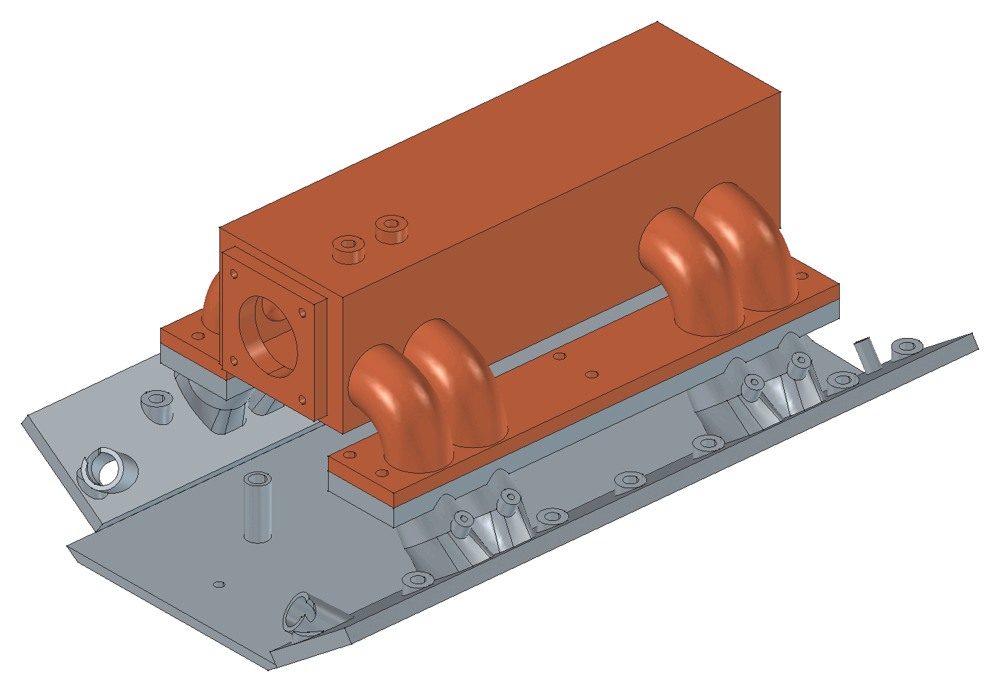

# ЗИЛ-130 и ЗИЛ-131 на впрыске

Открытый общественный проект: модернизация V8 ЗИЛ (6,0 л, по возможности и 7,0 л ЗИЛ-375) с переходом с газового смесителя или карбюратора на распределённый впрыск метана с электронным зажиганием. Цель — с умеренными затратами сделать рабочий двигатель экономичным. Два варианта: атмосферный и с наддувом.

**Сайт проекта: https://jidckii.github.io/zil_130/** — манифест, варианты переделки, что готово, как помочь.



## Принципы

- **Только метан.** Бензин не поддерживаем: так проще коллектор, проводка и прошивка.
- **Родной двигатель.** Блок не трогаем: меняем впуск, зажигание и управление, головки под ε 8,5. Устаревшее навесное рекомендуем заменить — прежде всего центрифугу масла на полнопоточный фильтр, — но это не обязательно.
- **Серийные покупные узлы**: газовые форсунки и редуктор, дроссель ЗМЗ-406, открытый ЭБУ rusEFI uaEFI121. Сами делаем только коллектор, кронштейны, переходники, шкив с кольцом 60-2.
- **Цена — как у перевода на газ.** Обязательная часть атмосферного комплекта должна стоить порядка установки газа.
- **Комплект ставится целиком, за один раз.** Всё готовится заранее, машина стоит несколько дней. Приоритет — момент на низах и экономичность, обороты почти заводские: 3200, с наддувом 3600.
- **У каждой цифры есть источник** — заводские чертежи и книги.

## Варианты

| | Атмосферный | С наддувом +0,3…0,5 бар |
|---|---|---|
| Общее | Свой коллектор (плита развала + ресивер), газ, зажигание, ЭБУ, головки под ε 8,5 | То же |
| Добавляется | — | Две турбины по одной на ряд, выпуск, интеркулер, усиленное охлаждение, сцепление, генератор 150 А, пары пружин, широкополосные λ-датчики |
| Смета, обязательное | ≈$2 100–4 000 | ≈$4 800–7 600 |
| Рекомендуем | фильтр вместо центрифуги, генератор 150 А, вискомуфта: ≈$520–750 | фильтр, вискомуфта |

Цель, состав и технические решения — [docs/project.md](docs/project.md), закупка и смета — [research/parts-list.md](research/parts-list.md), порядок работ и что осталось — [docs/plan.md](docs/plan.md).

## Навигация

| Каталог | Что там |
|---|---|
| [docs/](docs/) | Концепция ([project.md](docs/project.md)) и план работ ([plan.md](docs/plan.md)) |
| [research/](research/) | Исследования: [заводские данные](research/engine-data.md), [чужие переделки](research/prior-art.md), турбины, топливо, зажигание, охлаждение, [комплект и смета](research/parts-list.md) |
| [calc/](calc/) | Расчёты на Python: воздух, турбины, форсунки, раннеры, детонация — итоги в [results.md](calc/results.md) |
| [cad/](cad/) | Модели коллектора кодом на build123d, экспорт в STEP/STL, разрезка под 3D-печать, рабочие чертежи по ЕСКД — [литьё](https://jidckii.github.io/zil_130/docs/intake-cast) и [сварка](https://jidckii.github.io/zil_130/docs/intake-welded) |
| [ecu/](ecu/) | Настройки rusEFI, распиновка, Lua-скрипт с тестом |
| [docs-site/](docs-site/) | Сайт на Docusaurus |

## Запуск

```bash
uv run python calc/intake_sizing.py   # расчёты → calc/results.md
uv run python cad/receiver.py         # модель коллектора → cad/out/, падает при нарушении зазоров
uv run python cad/drawings.py         # чертежи и STEP для мастерской → docs-site/static/
lua ecu/zil130_test.lua               # проверка Lua-скрипта ЭБУ
cd docs-site && yarn && yarn start    # сайт локально
```

## Участие

Нужны замеры и фото с живых машин, печать макетов, сварка и фрезеровка, проверка расчётов, настройка rusEFI. С чего начать — [«Как помочь»](https://jidckii.github.io/zil_130/docs/contributing), задачи и вопросы — в [issues](https://github.com/jidckii/zil_130/issues).

## Лицензия

- Код (Python, Lua, JavaScript, включая CAD-скрипты) — [MIT](LICENSE).
- Тексты, изображения, рендеры, выгруженные модели (STEP/STL) — [CC BY 4.0](LICENSE-docs).

Обе лицензии разрешают любое использование, в том числе коммерческое, при условии указания авторства.

Не распространяются на чужие материалы: заводские чертежи в `research/sources/` и сканы из книг в `docs-site/static/img/factory/` — права на них у их правообладателей, источник указан рядом.
