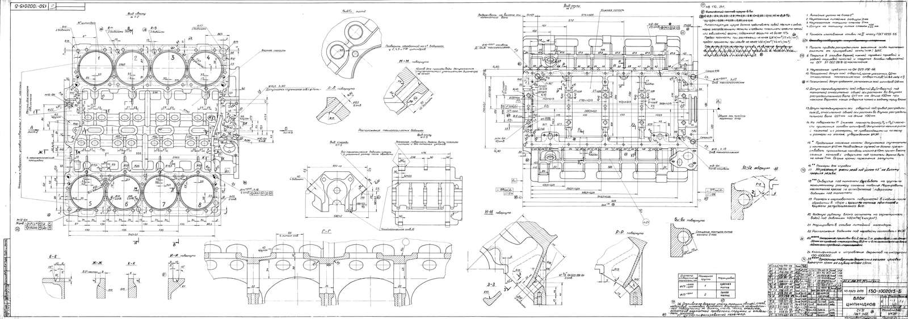
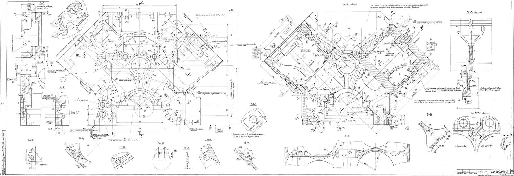
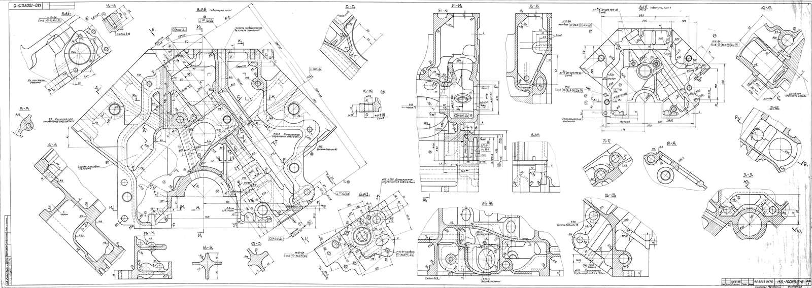
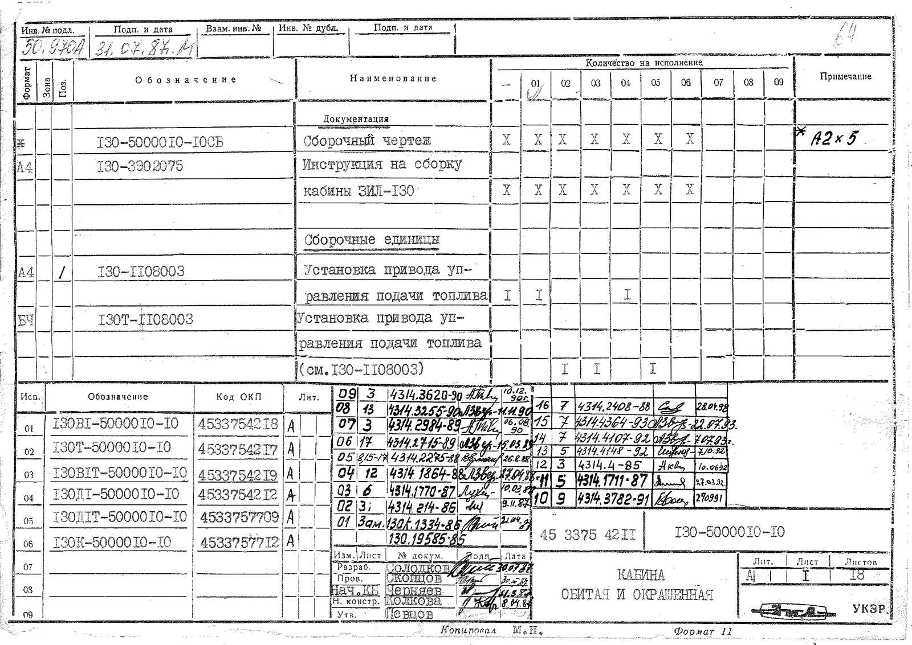
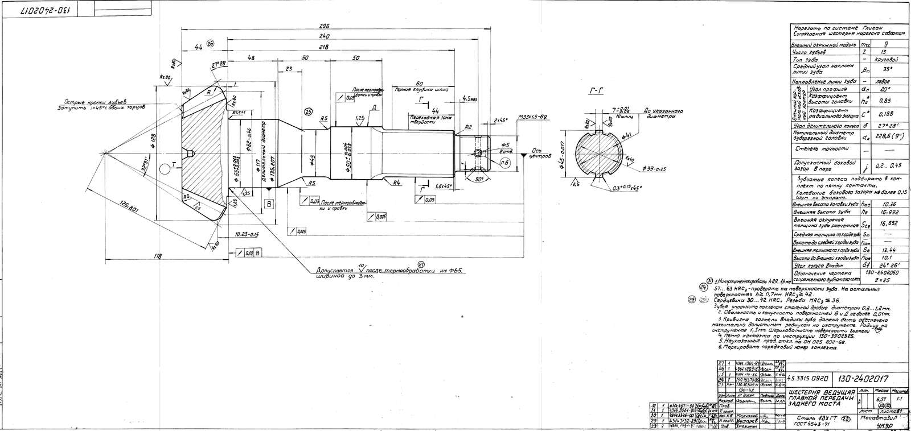
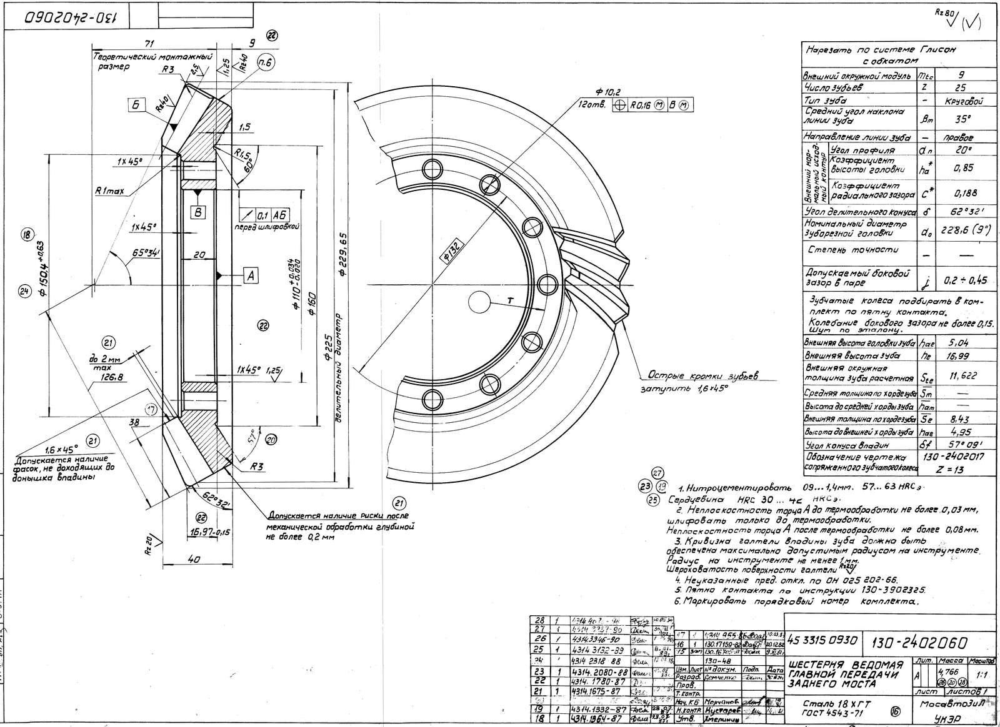
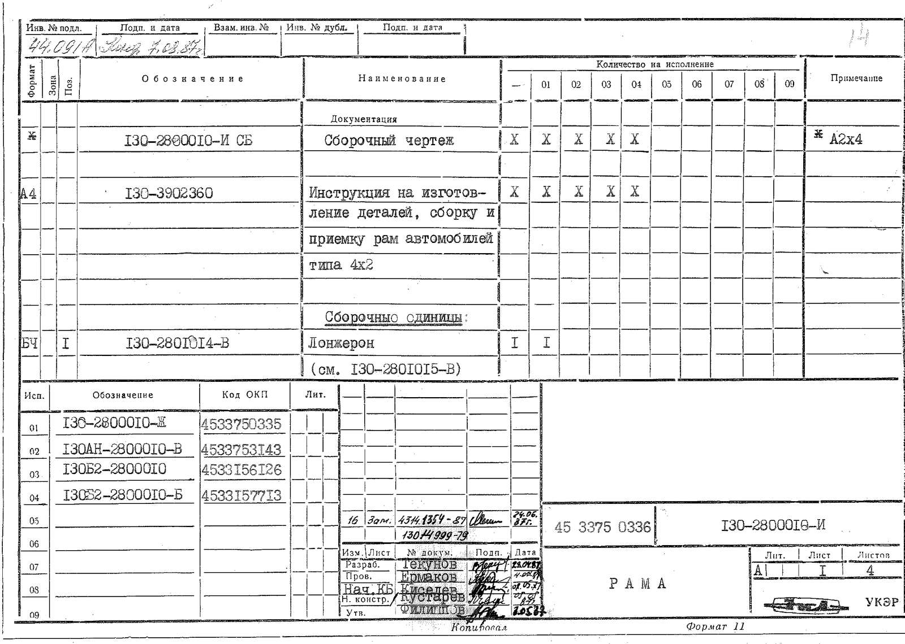
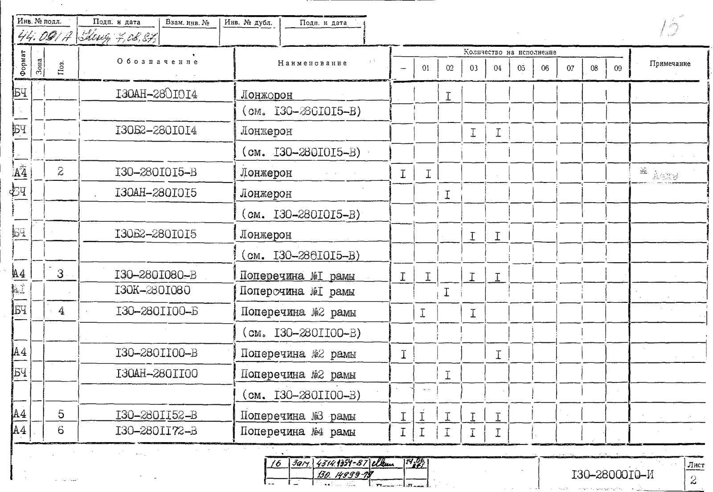
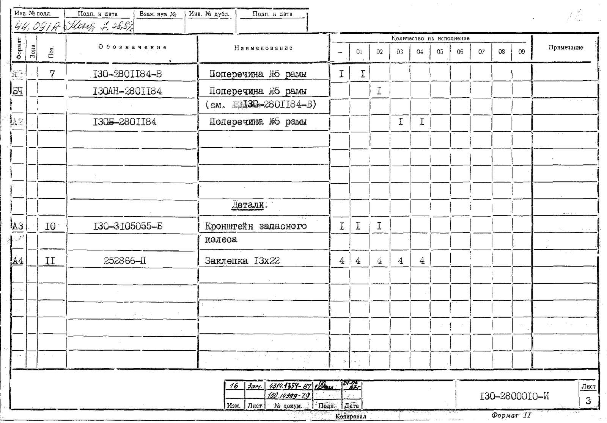
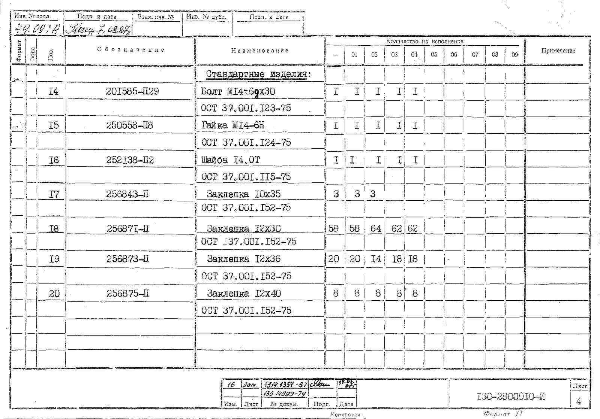

# Заводские чертежи ЗИЛ-130 и ЗИЛ-131

Чертежи куплены в магазине [autoar.org](https://autoar.org/), разделы ниже повторяют его каталог. Превью открывает оригинал — TIFF или PNG около 200 dpi, на который ссылается `research/engine-data.md`: `[HD87 л.2 вид И]`, `[BD л.1 вид сверху]`. Размеры снимать только с оригинала: у листов 1:1 это 7,85 px на мм, масштаб каждого вида — в его подписи.

Чертежи раздаём, чтобы проект можно было проверить и повторить. Если они вам пригодились — поддержите магазин и купите лист по ссылке рядом: так autoar оцифровывает следующие.

## [ЗИЛ-130](https://autoar.org/zil-130)

| Чертёж | Превью → оригинал | Где купить |
|---|---|---|
| 130-0000002-Д, габаритный чертёж. |  | [autoar](https://autoar.org/zil-130/obschiy-vid-avtomobilya-zil-130-obrazca-1969-g-clone/) |
| 130-0000010, общий вид 1963 г. |  | [autoar](https://autoar.org/zil-130/obschiy-vid-avtomobilya-zil-130/) |
| 130-0000010, общий вид 1969 г. |  | [autoar](https://autoar.org/zil-130/obschiy-vid-avtomobilya-zil-130-obrazca-1963-g-clone/) |
| 130-1002015-Б, блок цилиндров, 3 листа — **[BD]**. |    | [лист 1](https://autoar.org/zil-130/blok-cilindrov-zil-130/), [лист 2](https://autoar.org/zil-130/blok-cilindrov-zil-130-clone/), [лист 3](https://autoar.org/zil-130/blok-cilindrov-zil-130-list-2-clone/) |
| 130-1003012-20СБ, головка цилиндров, 3 листа — **[HD87]**. Вырезки видов: [l1_glavnyj_vid_osi_klapanov](zil-130/dvigatel/golovka-bloka-cilindrov/crops/l1_glavnyj_vid_osi_klapanov.png), [l1_vpusknoj_vintovoj_kanal_I1](zil-130/dvigatel/golovka-bloka-cilindrov/crops/l1_vpusknoj_vintovoj_kanal_I1.png), [l2_razrez_BB_klapan_flanec_P3](zil-130/dvigatel/golovka-bloka-cilindrov/crops/l2_razrez_BB_klapan_flanec_P3.png), [l2_razrez_VV_otverstie_M10_45](zil-130/dvigatel/golovka-bloka-cilindrov/crops/l2_razrez_VV_otverstie_M10_45.png), [l2_vid_I_flanec_vpuska_levaya](zil-130/dvigatel/golovka-bloka-cilindrov/crops/l2_vid_I_flanec_vpuska_levaya.png), [l2_vid_I_flanec_vpuska_pravaya](zil-130/dvigatel/golovka-bloka-cilindrov/crops/l2_vid_I_flanec_vpuska_pravaya.png) |    | [autoar](https://autoar.org/zil-130/golovka-cilindrov-zil-130-komplekt-iz-treh-listov/) |
| 130-5000010-10, кабина в сборе. |   | [autoar](https://autoar.org/zil-130/kabina-zil-130-v-sbore-obitaya-i-okrashennaya/) |
| 130-2402017, шестерня ведущая главной передачи. |  | [autoar](https://autoar.org/zil-130/shesternya-veduschaya-glavnoy-peredachi-zadnego-mosta-130-2402017/) |
| 130-2402060, шестерня ведомая главной передачи. |  | [autoar](https://autoar.org/zil-130/shesternya-vedomaya-glavnoy-peredachi-zadnego-mosta-130-2402060/) |
| 130-2402110-Б, шестерня ведомая цилиндрическая. |  | [autoar](https://autoar.org/zil-130/shesternya-vedomaya-cilindricheskaya-zadnego-mosta-130-2402110-b/) |
| 130-2402120-Б, шестерня ведущая цилиндрическая. |  | [autoar](https://autoar.org/zil-130/shesternya-veduschaya-cilindricheskaya-zadnego-mosta-130-2402120-b/) |
| 130-2800010-Б, рама в сборе. |  | [autoar](https://autoar.org/zil-130/rama-zil-130-v-sbore/) |
| 130-2800010-И, рама в сборе: сборочный чертёж и спецификация на 4 листах. |       | [autoar](https://autoar.org/zil-130/rama-zil-130-v-sbore-clone/) |

## [ЗИЛ-131](https://autoar.org/zil-131)

| Чертёж | Превью → оригинал | Где купить |
|---|---|---|
| 131-0000002, общий вид автомобиля. |  | [autoar](https://autoar.org/zil-131/chertezh-obschego-vida-avtomobilya-zil-131/) |
| 131-0002010, шасси, вид сбоку. |   | [autoar](https://autoar.org/zil-131/chertezh-obschego-vida-shassi-zil-130-vid-sboku/) |
| 131-0002010, шасси, вид сверху. |   | [autoar](https://autoar.org/zil-131/chertezh-obschego-vida-shassi-zil-130-vid-sverhu/) |
